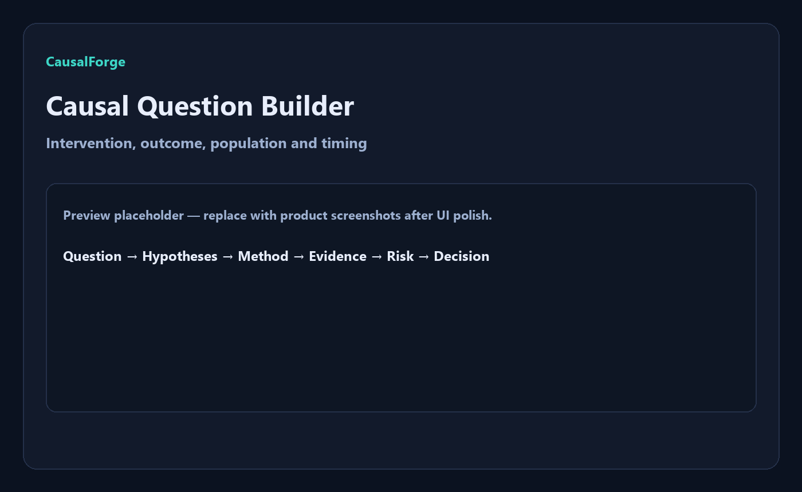
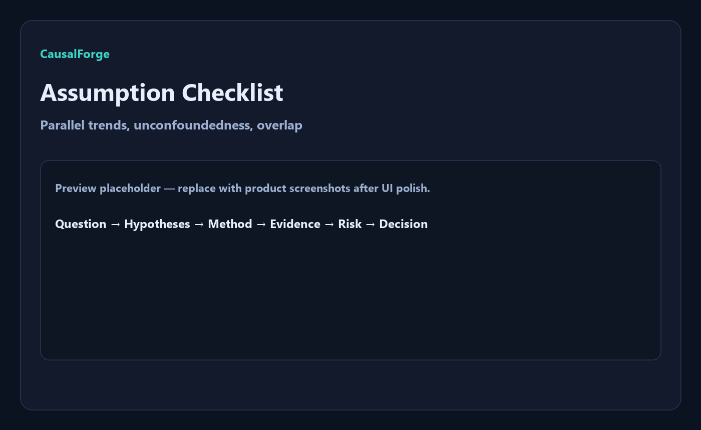
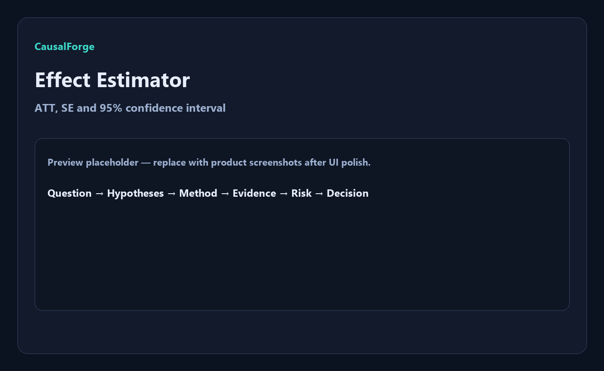
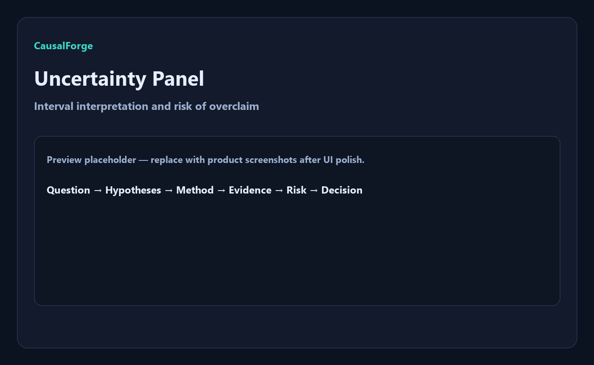
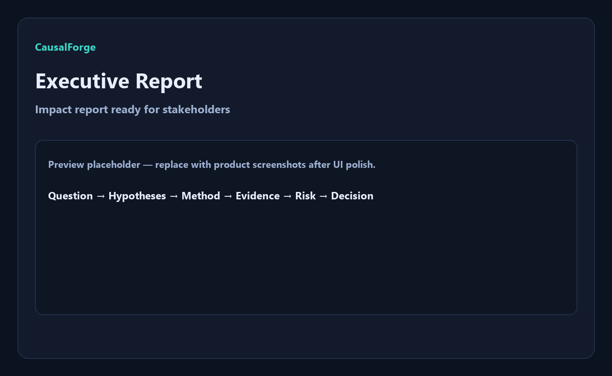
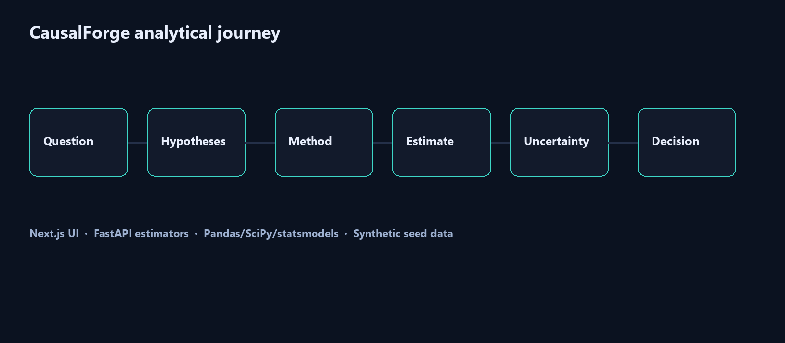

<div align="center">
  

  <h1>CausalForge</h1>

  <p><strong>Laboratório de inferência causal aplicada para avaliar intervenções de negócio com método, incerteza e limites declarados.</strong></p>
  <p><strong>Applied causal inference lab to evaluate business interventions with method, uncertainty and declared limitations.</strong></p>

  <p>
    <a href="#1-visão-geral--overview">PT-BR / English Overview</a> •
    <a href="#-product-preview">Preview</a> •
    <a href="#-screenshots">Screenshots</a> •
    <a href="#️-stack--tecnologias">Stack</a> •
    <a href="#-arquitetura--architecture">Architecture</a> •
    <a href="#-quick-start--início-rápido">Quick Start</a> •
    <a href="#-autor--author">Author</a>
  </p>

  <p>
    
    
    
    
    
    
  </p>
</div>

<p align="center">
  
</p>

---

## 1. Visão Geral / Overview

O **CausalForge** é um laboratório de inferência causal aplicada para avaliar intervenções de negócio: campanhas, mudanças operacionais, políticas, preço, atendimento ou produto.

Ele transforma a pergunta “a intervenção gerou impacto ou só pareceu?” em um fluxo rastreável de **pergunta causal, hipóteses, método, evidência, incerteza, risco e decisão**. Em vez de confundir correlação com impacto, o produto estima efeitos com pressupostos explícitos e limitações declaradas.

O projeto foi desenvolvido por **Felipe Alirio Baruja** como peça de portfólio que amplia o StatLab: sai do A/B didático para causalidade aplicada com dados observacionais, storytelling e decisão.

> **Responsible Causal Notice**  
> O CausalForge foi criado para avaliação analítica de intervenções com hipóteses e limites explícitos. Ele **não promete causalidade automática** e **não deve** ser usado como prova mágica de impacto nem para decisões automatizadas sobre indivíduos.

---

## ✨ Product Preview

<p align="center">
  
</p>

O CausalForge apresenta uma experiência de laboratório premium com jornada guiada: pergunta causal, checklist de hipóteses, estimador de efeito, painel de incerteza, decision memo e relatório executivo.

---

## 2. Por que este projeto importa? / Why this project matters

* **Correlação não é impacto:** Muitas análises de negócio confundem movimento de métrica com efeito causal da intervenção.
* **Decisões precisam de método:** Diff-in-Diff e matching básicos tornam o raciocínio contrafactual explícito, mesmo no MVP.
* **Incerteza é parte do produto:** Intervalos, pressupostos e limitações entram na interface — não ficam escondidos no rodapé de um notebook.
* **Responsabilidade analítica:** O produto comunica o que pode e o que não pode ser concluído a partir dos dados observacionais.

---

## 🧠 O diferencial do CausalForge / What makes CausalForge different

### Português
O CausalForge não é apenas um dashboard de métricas. Ele combina pergunta causal, checklist de hipóteses, estimadores transparentes e comunicação executiva em uma experiência navegável.

Ele mostra não apenas o efeito pontual, mas também:
- quais pressupostos sustentam a identificação;
- quão larga é a incerteza;
- quais limitações restringem a interpretação;
- o que um gestor pode decidir com responsabilidade;
- onde o desenho ainda é frágil e precisa de melhor evidência.

### English
CausalForge is not just a metrics dashboard. It combines a causal question, assumption checklist, transparent estimators and executive communication into one navigable experience.

It shows not only a point estimate, but also:
- which assumptions support identification;
- how wide the uncertainty is;
- which limitations restrict interpretation;
- what a manager can responsibly decide;
- where the design is still fragile and needs stronger evidence.

---

## 🎯 Problema que resolve / The problem it solves

Em fluxos reais de produto, growth e operações, decisões costumam ser tomadas com:
- métricas que sobem sem contrafactual claro;
- campanhas avaliadas só por antes/depois;
- análises sem hipóteses declaradas;
- relatórios que omitem incerteza e limites;
- risco de tratar correlação como prova de impacto.

O **CausalForge** cria uma camada organizada entre a intervenção observada e a decisão analítica final.

---

## 🧩 Proposta / Analytical Pipeline

O CausalForge processa um dataset sintético de operação (e, no roadmap, upload opcional) e entrega uma visão estruturada do efeito estimado:

```txt
Causal Question / Intervention
  ↓
Assumption Checklist
  ↓
Method Selection (Diff-in-Diff | Matching)
  ↓
Effect Estimation (ATT + SE)
  ↓
Uncertainty Panel (95% CI)
  ↓
Decision Memo + Limitations
  ↓
Executive Impact Report
```

---

## 📸 Screenshots

<table>
  <tr>
    <td width="50%">
      
      <br />
      <sub><strong>Causal Question Builder</strong> — intervention, outcome, population and timing made explicit.</sub>
    </td>
    <td width="50%">
      
      <br />
      <sub><strong>Assumption Checklist</strong> — parallel trends, unconfoundedness, overlap and SUTVA status.</sub>
    </td>
  </tr>
  <tr>
    <td width="50%">
      
      <br />
      <sub><strong>Effect Estimator</strong> — ATT point estimate with standard error and sample sizes.</sub>
    </td>
    <td width="50%">
      
      <br />
      <sub><strong>Uncertainty Panel</strong> — 95% CI interpretation and risk of overclaiming impact.</sub>
    </td>
  </tr>
  <tr>
    <td width="50%">
      
      <br />
      <sub><strong>Decision Memo</strong> — executive summary linking evidence to a responsible next action.</sub>
    </td>
    <td width="50%">
      
      <br />
      <sub><strong>Executive Report</strong> — impact narrative with methodology and declared limitations.</sub>
    </td>
  </tr>
</table>

---

## 📄 Executive Report

<p align="center">
  
</p>

O relatório executivo consolida pergunta causal, método, efeito, intervalo de confiança, checklist de hipóteses, limitações e decision memo em um artefato pronto para stakeholders.

---

## 📌 Estudo de Caso / Case Study

### 📌 Estudo de Caso: Campanha Promocional em Painel Operacional Sintético
O dataset demo simula um painel de varejo com **80 linhas**, **5 regiões**, períodos **pre/post** e uma campanha promocional aplicada à região **South** no pós. O outcome é `revenue`; covariáveis incluem `store_size` e `baseline_traffic`.

O estimador Diff-in-Diff recupera um ATT próximo do efeito gerado nos dados sintéticos (~+35), enquanto o matching básico oferece uma segunda leitura sob unconfoundedness condicional. Em ambos os casos, o produto exibe CI, pressupostos e limitações — nunca uma “prova automática”.

### 📌 Case Study: Synthetic Promo Campaign Panel
The demo dataset simulates a retail panel with **80 rows**, **5 regions**, **pre/post** periods and a promo campaign applied to the **South** region in the post period. The outcome is `revenue`; covariates include `store_size` and `baseline_traffic`.

Diff-in-Diff recovers an ATT close to the synthetic data-generating effect (~+35), while basic matching provides a second reading under conditional unconfoundedness. Both paths surface CI, assumptions and limitations — never an “automatic proof”.

---

## 🧭 Visual Story / Jornada Analítica

A experiência do CausalForge foi pensada como uma jornada causal guiada:
```txt
1. Definir a pergunta causal e a intervenção
2. Carregar o dataset sintético de operação (ou upload opcional no roadmap)
3. Revisar o checklist de hipóteses identificadoras
4. Escolher Diff-in-Diff simples ou matching básico
5. Estimar ATT com erro-padrão e intervalo de confiança
6. Ler o painel de incerteza e o risco de overclaim
7. Gerar o decision memo executivo
8. Exportar / apresentar o relatório de impacto com limitações
```

---

## ⚙️ Funcionalidades Principais / Core Features

### Causal Question Builder
Estrutura a intervenção, o outcome, a unidade tratada e o timing antes de qualquer estimativa.

### Assumption Checklist
Torna explícitos pressupostos como parallel trends, no anticipation, unconfoundedness, overlap e SUTVA.

### Effect Estimator
Calcula ATT via Diff-in-Diff simples ou matching nearest-neighbor básico sobre o dataset demo.

### Uncertainty Panel
Exibe erro-padrão e intervalo de confiança de 95%, com interpretação cuidadosa quando o intervalo cruza zero.

### Decision Memo
Resume evidência, risco e próxima ação responsável para gestores de produto, growth e operações.

### Limitations & Responsible Use
Cada resultado carrega limitações declaradas e um disclaimer contra causalidade automática.

---

## 🛠️ Stack / Tecnologias

### Frontend
- **Framework:** Next.js 15 (App Router) & React 19
- **Linguagem:** TypeScript
- **UI:** CSS moderno com jornada de laboratório
- **Gráficos (roadmap/UI):** Recharts
- **Ícones:** Lucide Icons

### Backend
- **Framework API:** FastAPI & Uvicorn (Python 3.12)
- **Modelagem & Validação:** Pydantic v2
- **Processamento de Dados:** Pandas
- **Estimação:** SciPy, statsmodels, scikit-learn
- **Suite de Testes:** Pytest

---

## 🧱 Arquitetura / Architecture

O projeto adota uma arquitetura monorepo simplificada e desacoplada:

```text
CausalForge/
├── apps/
│   ├── web/                         # Frontend Next.js (App Router)
│   │   ├── app/                     # Páginas e estilos
│   │   ├── components/              # UI (em evolução)
│   │   ├── lib/                     # API client
│   │   └── types/                   # Tipos TypeScript
│   │
│   └── api/                         # Backend FastAPI
│       ├── app/
│       │   ├── api/                 # Endpoints (/demo, /estimate, /methodology)
│       │   ├── models/              # Schemas Pydantic
│       │   └── services/            # Demo data + estimators
│       └── tests/                   # Testes do pipeline (pytest)
│
├── data/
│   └── seed/                        # Painel sintético ops_intervention_demo.csv
│
├── docs/                            # Pitch, metodologia e roadmap
├── assets/                          # Ícone, hero, architecture e screenshots
├── scripts/                         # Geração de assets
├── start.bat                        # Inicializador integrado Windows
└── README.md                        # Esta documentação
```

---

## 🧱 Visual Architecture

<p align="center">
  
</p>

CausalForge follows a traceable causal flow: question and intervention enter the lab, assumptions are declared, a method estimates impact with uncertainty, and a decision memo closes the loop with explicit limitations.

---

## 🔁 Data Flow Pipeline

```txt
Synthetic Panel / Optional Upload
  ↓
Causal Question + Intervention Selection
  ↓
Assumption Checklist
  ↓
Estimator (DiD or Matching)
  ↓
ATT + Standard Error + 95% CI
  ↓
Decision Memo / Limitations / Executive Report
```

---

## 🚀 Quick Start / Início Rápido

### Pré-requisitos
- **Node.js** v20 ou superior.
- **Python** v3.10 ou superior (preferencialmente Python 3.12).
- **Git**

### Opção 1 — Execução integrada no Windows
Na pasta raiz do projeto, dê dois cliques ou execute no console:
```bash
start.bat
```
Este script inicializa o ambiente virtual Python (`apps/api/.venv`), instala dependências, sobe o backend FastAPI na porta `8000`, o frontend Next.js na porta `3000` e abre a aplicação no navegador.

### Opção 2 — Execução manual

#### 1. Backend FastAPI (`apps/api`)
```bash
cd apps/api
python -m venv .venv
.venv\Scripts\activate            # Windows
source .venv/bin/activate          # Linux/macOS
pip install -r requirements.txt
uvicorn app.main:app --reload --port 8000
```
*API ativa em [http://127.0.0.1:8000](http://127.0.0.1:8000). Docs interativos em `/docs`.*

#### 2. Frontend Next.js (`apps/web`)
```bash
cd apps/web
npm install
npm run dev
```
*Frontend ativo em [http://localhost:3000](http://localhost:3000).*

---

## 🧪 Scripts e Testes / Scripts and Testing

### Rodar Testes de Backend (FastAPI/Pytest)
```bash
cd apps/api
.venv\Scripts\python -m pytest
```

### Validações de Frontend (Next.js)
```bash
cd apps/web
npm run lint         # Verificação de lint
npm run typecheck    # Verificação estrita de TypeScript
npm run build        # Compilação de produção
```

### Gerar assets visuais
```bash
pip install pillow
python scripts/generate_assets.py
```

---

## 📊 Metodologia Estatística / Statistical Methodology

O CausalForge MVP utiliza estimadores clássicos com foco em transparência:
* **Difference-in-Differences (simples):** ATT = (Y_post^T − Y_pre^T) − (Y_post^C − Y_pre^C), sob parallel trends.
* **Matching nearest-neighbor:** pareamento 1:1 em `store_size` e `baseline_traffic` no período post.
* **Incerteza:** erro-padrão conservador e intervalo de confiança aproximado de 95%.
* **Comunicação:** checklist de hipóteses + limitações + decision memo em todo resultado.

Detalhes em [docs/technical_methodology.md](./docs/technical_methodology.md).

---

## 🛡️ Segurança, Ética e Boas Práticas

* **Sem causalidade automática:** o produto recusa a narrativa de “um clique = prova causal”.
* **Dados sintéticos no demo:** o seed é controlado para validar métodos sem PII real.
* **Limitações sempre visíveis:** cada estimativa carrega disclaimer e restrições de interpretação.
* **Fora de escopo:** decisões automatizadas sobre indivíduos; discovery causal mágico; overclaim de impacto.

---

## 🧭 Roadmap do Produto

* **MVP:** dataset sintético, DiD simples, matching básico, checklist, uncertainty panel e decision memo.
* **Fase 2:** propensity score, DAG visual, placebo tests, sensitivity analysis e comparação de métodos.
* **Fase 3:** notebooks reproduzíveis, API de experimentos, integração com métricas reais e biblioteca de estudos de caso.

Veja [docs/product_roadmap.md](./docs/product_roadmap.md).

---

## 💼 Valor para Portfólio / Portfolio Value

O CausalForge demonstra competências críticas para funções de **Data Science, Analytics Engineering e Product Analytics**:
- **Inferência causal aplicada:** DiD, matching, contrafactual e viés.
- **Comunicação executiva:** decision memo com incerteza e limites.
- **Responsabilidade analítica:** ética e anti-overclaim.
- **Arquitetura full-stack:** Next.js 15 + FastAPI em monorepo.

---

## 📚 Documentação Complementar

- [docs/portfolio_pitch.md](./docs/portfolio_pitch.md) — roteiros de entrevista e pitch.
- [docs/technical_methodology.md](./docs/technical_methodology.md) — lógica estatística do MVP.
- [docs/product_roadmap.md](./docs/product_roadmap.md) — fases MVP → 2 → 3.

---

## 🖼️ GitHub Social Preview

Uma imagem para visualização social está disponível em:
```txt
assets/social-preview.png
```
*Dimensão recomendada: 1280x640, <1MB. Faça upload em: Repository Settings → Social Preview.*

---

## 🔖 GitHub Repository Metadata

### About sugerido
```txt
Applied causal inference lab for business interventions — Diff-in-Diff, matching, uncertainty and decision memos with declared limitations.
```

### Topics sugeridos
```txt
causal-inference
difference-in-differences
matching
statistics
fastapi
nextjs
typescript
python
scipy
statsmodels
responsible-analytics
portfolio-project
ab-testing
observational-data
decision-memo
```

---

## 👤 Autor / Author

Desenvolvido por **Felipe Alirio Baruja**.

- **Portfolio:** [barujafe.vercel.app](https://barujafe.vercel.app/)
- **GitHub:** [@BarujaFe1](https://github.com/BarujaFe1)
- **LinkedIn:** [Gustavo Felipe Alirio Baruja](https://www.linkedin.com/in/barujafe/)

---

## 📄 Licença / License

MIT License. Copyright (c) 2026 Felipe Alirio Baruja.
O código está disponível sob a licença MIT caso o arquivo `LICENSE` esteja presente no repositório.
