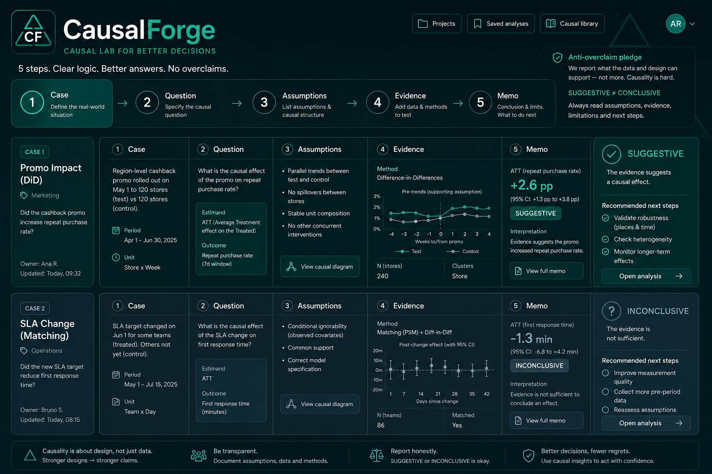
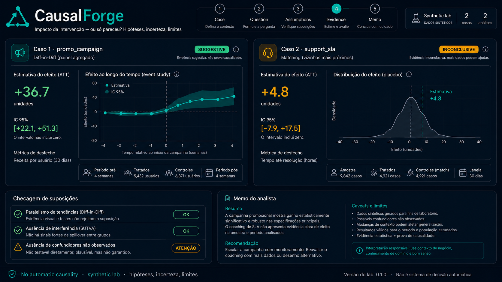
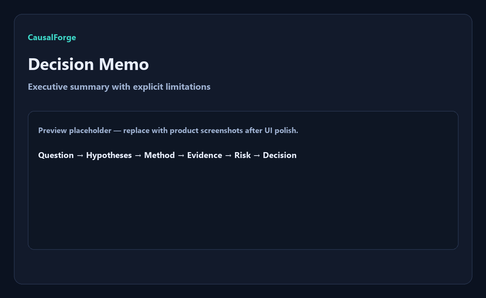

<div align="center">
  

  <h1>CausalForge</h1>

  <p><strong>A intervenção gerou impacto — ou só pareceu?</strong></p>
  <p>
    Laboratório de inferência causal responsável: Diff-in-Diff, matching,
    incerteza e decision memos com limitações declaradas.
  </p>
  <p>
    <em>Responsible causal inference lab for business interventions —
    estimates with assumptions, uncertainty and explicit limits. No automatic causality.</em>
  </p>

  <p>
    <a href="https://causalforge-rose.vercel.app">Live demo</a> ·
    <a href="#problema">Problema</a> ·
    <a href="#solução">Solução</a> ·
    <a href="#arquitetura">Arquitetura</a> ·
    <a href="#quick-start">Quick Start</a> ·
    <a href="#o-que-este-projeto-demonstra">Portfolio</a>
  </p>

  <p>
    
    
    
    
    
    
  </p>
</div>

<p align="center">
  
</p>

---

## Status

| Item | Estado |
|---|---|
| MVP demo | **Live** — [causalforge-rose.vercel.app](https://causalforge-rose.vercel.app) |
| API | [causalforge-api.vercel.app](https://causalforge-api.vercel.app) |
| CI | GitHub Actions (pytest, ruff, typecheck, lint, build) |
| Dados | Sintéticos apenas (sem PII) |
| Promessa | **Não** oferece causalidade automática |

---

## Problema

Times de produto, growth e operações frequentemente:

- confudem **correlação** com **impacto**;
- avaliam campanhas só com antes/depois;
- omitem hipóteses identificadoras;
- escondem incerteza e limites no rodapé de um notebook.

A dor concreta: decisões caras em cima de evidência frágil.

---

## Solução

O **CausalForge** força uma jornada analítica explícita:

```text
Caso sintético → Pergunta causal → Hipóteses → Método → Evidência (ATT + IC) → Decision memo + caveats
```

Dois casos controlados ensinam o contraste certo:

| Caso | Método sugerido | Sinal esperado |
|---|---|---|
| Campanha promocional (varejo) | Diff-in-Diff | **SUGGESTIVE** (ATT ≈ +35 no DGP) |
| Coaching de SLA (suporte) | Matching | **INCONCLUSIVE** com frequência (ruído residual) |

Rótulos de produto (contrato):

- **SUGGESTIVE** — IC 95% exclui zero *sob hipóteses declaradas* (ainda **não** é prova).
- **INCONCLUSIVE** — IC inclui zero → **não** reivindique impacto.

> **Responsible Causal Notice**  
> Estimativas observacionais dependem de pressupostos. CausalForge reporta efeito com incerteza e limites. Não substitui RCT nem julgamento de domínio. Não automatiza decisões sobre pessoas.

---

## Principais funcionalidades

- **Case picker** — dois demos sintéticos com narrativa de negócio
- **Assumption checklist** — parallel trends / unconfoundedness / overlap / SUTVA
- **Effect estimator** — DiD simples ou matching NN com covariáveis **z-scored**
- **Uncertainty panel** — SE, IC 95%, flag `crosses_zero`
- **Decision memo** — texto executivo + limitations + caveats + disclaimer
- **Degraded mode** — UI navegável se a API estiver offline (estimativa bloqueada)

<p align="center">
  
</p>

---

## Arquitetura

```text
Browser (Next.js apps/web)
        │  NEXT_PUBLIC_API_URL
        ▼
FastAPI (apps/api)
  /api/cases · /api/demo · /api/estimate · /api/methodology
        │
        ▼
demo_data.py  →  estimators.py (DiD + standardized matching)
        │
        ▼
data/seed/*.csv  (synthetic ground truth)
```

Detalhes: [docs/ARCHITECTURE.md](./docs/ARCHITECTURE.md) · [docs/TECHNICAL_DECISIONS.md](./docs/TECHNICAL_DECISIONS.md)

### Stack

| Camada | Tecnologia |
|---|---|
| Frontend | Next.js 15, React 19, TypeScript |
| Backend | FastAPI, Pydantic v2, Uvicorn |
| Analytics | Pandas, NumPy, SciPy |
| Deploy | Vercel (web) + Vercel Python (API) |
| Qualidade | Pytest, Ruff, ESLint, tsc, GitHub Actions |

---

## Quick Start

### Pré-requisitos

- Node.js 20+
- Python 3.12+
- Git

### Opção A — Windows integrado

```bash
start.bat
```

### Opção B — Manual

**API**

```bash
cd apps/api
python -m venv .venv
.venv\Scripts\activate          # Windows
# source .venv/bin/activate     # Linux/macOS
pip install -r requirements.txt
uvicorn app.main:app --reload --port 8000
```

**Web**

```bash
cd apps/web
npm ci
set NEXT_PUBLIC_API_URL=http://127.0.0.1:8000
npm run dev
```

- Web: http://localhost:3000  
- API docs: http://127.0.0.1:8000/docs  

### Variáveis de ambiente

Copie [.env.example](./.env.example):

```bash
NEXT_PUBLIC_API_URL=http://127.0.0.1:8000
CORS_ORIGINS=http://localhost:3000,http://127.0.0.1:3000
```

Nunca commite `.env`, `.env.local` ou tokens Vercel/OIDC.

---

## Testes

```bash
# API
cd apps/api
.venv\Scripts\python -m pytest
.venv\Scripts\ruff check app tests

# Web
cd apps/web
npm run typecheck
npm run lint
npm run build
```

Guia: [docs/TESTING.md](./docs/TESTING.md)

---

## Decisões técnicas e trade-offs

| Decisão | Trade-off |
|---|---|
| Labels `suggestive`/`inconclusive` em vez de “winner” | Menos marketing; mais rigor |
| Dual Vercel (web + API) | CORS + cold start SciPy |
| Seeds sintéticos only | Sem PII; não é plataforma de produção |
| Z-score antes do matching | Ainda sem propensity / overlap diagnostics |
| Sem DoWhy/EconML no MVP | Bundle menor; menos “magia” |

Mais: [docs/TECHNICAL_DECISIONS.md](./docs/TECHNICAL_DECISIONS.md) · metodologia: [docs/technical_methodology.md](./docs/technical_methodology.md)

---

## Roadmap

- **MVP (agora):** 2 casos, DiD, matching padronizado, memo, CI, deploy
- **Fase 2:** propensity score, DAG, placebo/pre-trends, sensitivity, method compare
- **Fase 3:** notebooks, experiment API, case library, métricas reais (com governança)

---

## O que este projeto demonstra

- Inferência causal aplicada (DiD, matching, contrafactual, viés)
- Comunicação de **incerteza** e **limites** como feature de produto
- Responsible analytics (anti-overclaim)
- Full-stack: Next.js + FastAPI monorepo
- Testes de regressão no DGP sintético (~+35 ATT)
- Deploy dual Vercel com CORS e modo degradado

---

## Como eu apresentaria em entrevista

1. **Problema de negócio:** “Times tratam lift de dashboard como prova causal.”
2. **Contrato do produto:** “Eu forço hipóteses antes do número e rotulo evidência como suggestive ou inconclusive.”
3. **Demo ao vivo:** caso promo (sinal claro) vs SLA (intervalo cruza zero) — o segundo caso é o diferencial pedagógico.
4. **Rigor técnico:** “Matching z-scored; SE de DiD usa `unit_id`/`agent_id` quando existe; disclaimer sempre presente.”
5. **Limite honesto:** “MVP não faz propensity, placebo nem sensitivity — e eu documentei isso de propósito.”
6. **Próximo passo:** “Se fosse produção, eu adicionaria pre-trends, balance tables e design review antes de qualquer scale-up.”

Roteiro extra: [docs/portfolio_pitch.md](./docs/portfolio_pitch.md)

---

## Documentação

| Doc | Conteúdo |
|---|---|
| [docs/AUDIT_REPORT.md](./docs/AUDIT_REPORT.md) | Auditoria do quality pass |
| [docs/ARCHITECTURE.md](./docs/ARCHITECTURE.md) | Arquitetura |
| [docs/TECHNICAL_DECISIONS.md](./docs/TECHNICAL_DECISIONS.md) | ADRs |
| [docs/TESTING.md](./docs/TESTING.md) | Testes |
| [docs/DEPLOYMENT.md](./docs/DEPLOYMENT.md) | Deploy Vercel |
| [docs/HANDOFF.md](./docs/HANDOFF.md) | Handoff do quality pass |
| [docs/technical_methodology.md](./docs/technical_methodology.md) | Matemática do MVP |

---

## Autor

**Felipe Alirio Baruja**

- Portfolio: [barujafe.vercel.app](https://barujafe.vercel.app/)
- GitHub: [@BarujaFe1](https://github.com/BarujaFe1)
- LinkedIn: [Gustavo Felipe Alirio Baruja](https://www.linkedin.com/in/barujafe/)
- Projeto no portfólio: `/projetos/causal-forge`

---

## Licença

MIT License © 2026 Felipe Alirio Baruja
